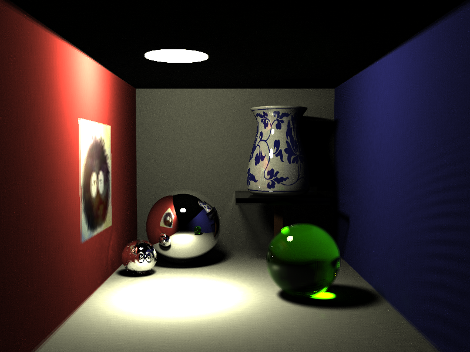
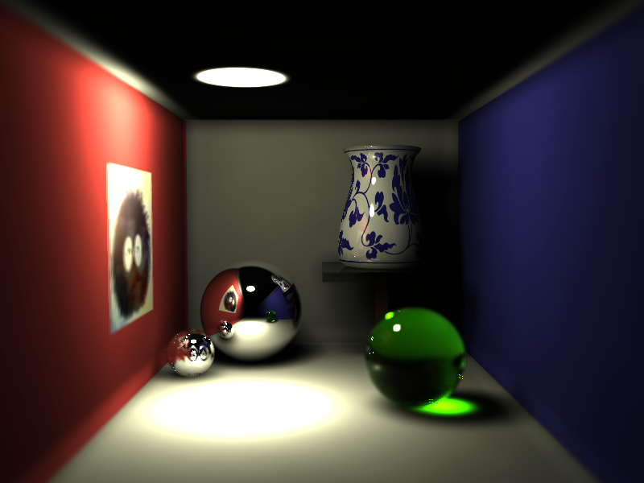
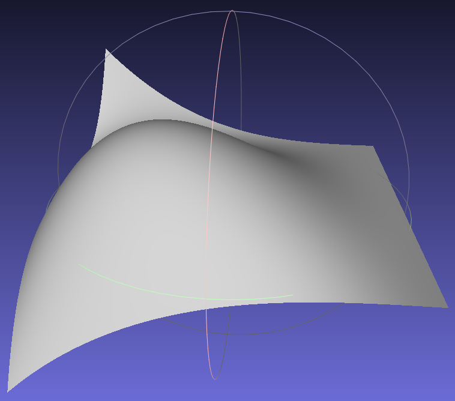
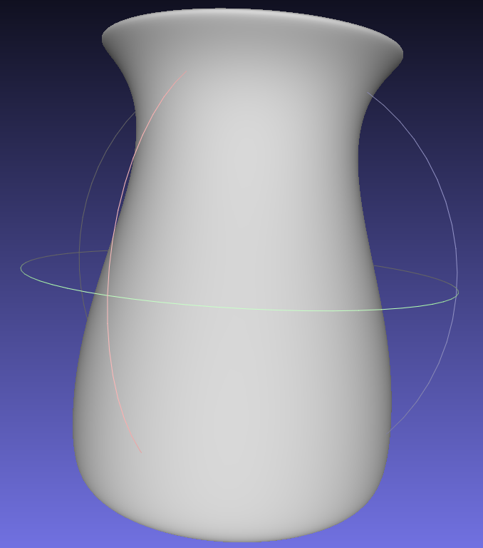

# 基于Bézier曲线的三维造型与渲染系统实现

## 功能概要

本项目我实现的功能主要有：

* 生成Bézier曲面或Bézier曲线旋转曲面的三角网格（obj格式文件）
* 使用渐进式光子映射（Progressive Photon Mapping）进行渲染
* Bézier曲线旋转曲面求交
* 相机模型，景深效果
* 纹理映射
* 凹凸（纹理）映射
* 使用kd-tree以及多线程加速渲染

**最终效果**

高清大图见`demo/demo.png`，另外几个例子见`demo/`。

a. 相机光圈采样4次，渐进式光子映射迭代4460次，每次100000光子，$\alpha=0.7$，初始半径1.00。



b. 相机光圈采样16次，渐进式光子映射迭代90次，每次100000光子，$\alpha=0.7$，初始半径10.0。



可以看出，初始半径大，则图片噪声更小，图片更加平滑，但是光照细节部分丢失，边缘部分偏差较大；初始半径小，会导致图片噪声大，但是光照细节部分体现得很好，边缘部分偏差较小。此外，我还发现，选定的初始半径大不大取决于场景，所以实际上是考虑初始半径相对于场景的大小情况。

## 实现细节

### 生成三角网格

这个功能实现比较简单，只需要离散地采样，算出参数方程的取值之后小心地组织成三角面片即可。Bézier曲线参数方程求值我使用de Casteljau's算法实现。为了加快速度，我使用的是迭代的方式。

生成Bézier曲面的三角网格过程中，计算某个点取值的主要代码如下（`bezier_surface.cpp`）：

```c++
vector3df bezier_surface::get_point(double u, double v) const
{
    // de Casteljau's algorithm
    bezier_surface p = *this; // copy, k, l = 0
    // k = 1, ..., m, l = 0
    for (std::size_t k = 1; k < width; ++k)
    {
        for (std::size_t j = 0; j < height - 0; ++j)
        {
            for (std::size_t i = 0; i < width - k; ++i)
            {
                p(i, j) = p(i, j) * (1 - u) + p(i + 1, j) * u;
            }
        }
    }
    // k = m, l = 1, ..., n
    for (std::size_t l = 1; l < height; ++l)
    {
        for (std::size_t j = 0; j < height - l; ++j)
        {
            // for (std::size_t i = 0; i < width - (width - 1); ++i)
            p(0, j) = p(0, j) * (1 - v) + p(0, j + 1) * v;
        }
    }
    return p(0, 0);
}
```

计算Bézier曲线参数方程取值主要如下（`bezier_curve.cpp`）：

```c++
vector3df bezier_curve::get_point(double t) const
{
    // de Casteljau's algorithm
    bezier_curve p = *this; // copy, k = 0
    for (std::size_t k = 1; k <= n; ++k)
    {
        for (std::size_t i = 0; i <= n - k; ++i)
        {
            p[i] = p[i] * (1 - t) + p[i + 1] * t;
        }
    }
    return p[0];
}
```

为了得到Bézier曲线旋转得到的曲面，还需要对角度进行离散化，使用三角函数等计算每个角度下，（离散化之后的）曲线上每个点的坐标。实现在`bezier_curve::to_rotate_surface_mesh`。

获得obj结果如图所示：





### 渐进式光子映射

渐进式光子映射（Progressive Photon Mapping）是2008年由Toshiya Hachisuka等人提出的方法，主要改进光子映射为了获得精确图片而需要大量内存的不足。

算法分为两个大步：

1. （一次）光线跟踪：计算视点出发到最近的漫反射面的交点（`hit_point`）。
2. （多轮）光子发射：从光源发射光子，用类似光线跟踪的方法跟踪光子，碰到漫反射面时寻找附近的`hit_point`，认为这个光子打在它们上面了，更新相应的参数。发射完一轮之后需要统一更新`hit_point`的参数，包括减小半径，用BRDF计算光通量等。
3. 生成图片：每一轮或多轮光子发射完之后可以生成图片。对每一个`hit_point`，计算它对相应像素颜色的贡献值，并叠加到光线跟踪渲染出的图片（一般情况下，是纯黑的图片）上，即可得到最终渲染的图片。

为了得到足够精确的结果，光子发射需要迭代几千轮。实现在`camera.cpp`文件中。

### Bézier曲线旋转曲面求交

参考教材《计算机图形学基础教程（第2版）》107页的方法，我使用牛顿迭代法进行求交。

如果记光线$\mathbf{L}(l), l \gt 0$，Bézier曲线旋转曲面$\mathbf{S}(\theta, t), \theta \in [0, 2\pi), t \in [0,1]$，则具体方程如下：

$$ \mathbf{f}(l, \theta, t) = \mathbf{L}(l) - \mathbf{S}(\theta, t)$$

$$ D = \frac{\partial \mathbf{L}}{\partial l} \cdot (\frac{\partial \mathbf{S}}{\partial t} \times \frac{\partial \mathbf{S}}{\partial \theta}) $$

$$ l_{i+1} = l_i - \frac{\frac{\partial \mathbf{S}}{\partial t} \cdot (\frac{\partial \mathbf{S}}{\partial \theta} \times \mathbf{f})}{D} $$

$$ \theta_{i+1} = \theta_i + \frac{\frac{\partial \mathbf{L}}{\partial l} \cdot (\frac{\partial \mathbf{S}}{\partial t} \times \mathbf{f})}{D} $$

$$ t_{i+1} = t_i - \frac{\frac{\partial \mathbf{L}}{\partial l} \cdot (\frac{\partial \mathbf{S}}{\partial \theta} \times \mathbf{f})}{D} $$

注意到$\frac{\partial \mathbf{S}}{\partial t}$中需要用到Bézier曲线的导数。将Bézier曲线参数方程列出：

$$ \mathbf{P}(t)= \sum_{i=0}^{n} \mathbf{P}_i B_{i,n}(t) $$

导数为，

$$ \frac{\mathrm{d}\mathbf{P}(t)}{\mathrm{d} t}= \sum_{i=0}^{n} \mathbf{P}_i \frac{\mathrm{d}B_{i,n}}{\mathrm{d}t} $$

$$ =  \frac{\mathrm{d}\mathbf{P}(t)}{\mathrm{d} t} = n\sum_{i=0}^{n} \mathbf{P}_i (B_{i-1,n-1}(t)-B_{i,n-1}(t) ) $$

$$ = n(\sum_{i=0}^{n-1} \mathbf{P}_{i+1} B_{i,n-1}(t) -  \sum_{i=0}^{n-1} \mathbf{P}_i B_{i,n-1}(t)) $$

$$ = \sum_{i=0}^{n-1} n(\mathbf{P}_{i+1} - \mathbf{P}_i) B_{i,n-1}(t) $$

这事实上是一个新的、阶数低1的Bézier曲线形式的表达式，控制点为$n(\mathbf{P}_{i+1} - \mathbf{P}_i) , i = 0, 1, \dots, n-1$，所以只需要计算出控制点具体数值，就可以用同样的代码进行求值了。

**初始值的选定** 一个比较好的初值能够加快迭代收敛，这里，我使用了光线与上面生成的三角面片的交点作为初始值。一般迭代5~10次便可获得所需要的精度。如此选择初值，既能够快快收敛，也可以得到很精确的结果。不过，三角面片的精细程度与求解收敛速度之间需要进行权衡（三角面片越精细，收敛越快但求三角面片交点越慢；三角面片越粗糙，求三角面片交点越快但收敛越慢，甚至无法收敛到正确结果），以获得最快的求交速度。

**法向量的计算** 得到交点之后，还需要计算法向量，方法比较简单，只需要计算$\frac{\partial \mathbf{S}}{\partial \theta} \times \frac{\partial \mathbf{S}}{\partial t} $，标准化之后即可使用。

相关代码：

```c++
intersect_result rotate_bezier::intersect(const ray &r, double t0, double u0, double v0) const
{
    // u: theta, v: t
    double t = t0, u = u0, v = v0;
    vector3df point, d_dt, d_dtheta;
    for (std::size_t i = 0; i < 15; ++i)
    {
        curve.get(v, u, point, d_dt, d_dtheta); // 获得Bézier曲线上一点的坐标以及两个偏导数
        vector3df f = r.origin + r.direction * t - point;
        if (f.length2() < eps2)
        {
            if (t <= eps || v < 0.0 || v > 1.0)
            {
                return intersect_result::failed;
            }

            return intersect_result(r.origin + r.direction * t,
                                    d_dtheta.cross(d_dt).normalize(), t,
                                    u, v);
        }

        double D = r.direction.dot(d_dt.cross(d_dtheta));
        t -= d_dt.dot(d_dtheta.cross(f)) / D;
        v -= r.direction.dot(d_dtheta.cross(f)) / D;
        u += r.direction.dot(d_dt.cross(f)) / D;
        if (u < 0.0)
        {
            u = -u + M_PI;
        }
        if (u >= 2 * M_PI)
        {
            u = fmod(u, 2 * M_PI);
        }
    }
    return intersect_result::failed;
}
```

### 景深效果

为了实现景深效果，需要为相机模型引入光圈aperture、焦距focal_length两个参数。

首先，渲染出的图像上每一个像素实际上对应底片（或焦平面）上一个点$\mathbf{d}$，考虑相机的位置$\mathbf{p}$，该点相对于世界的坐标为$\mathbf{t}=\mathbf{p} + \mathbf{d}$。

底片某点获得的光强，考虑到透镜的作用的同时做一些简化，可以认为是光线通过光圈，打到这一点的光强的累加（积分）。在从底片向场景发射光线的时候，可以对光圈进行采样（均匀或者随机，我选择均匀采样），采样点记为$\mathbf{o}$（绝对坐标），则这根光线从底片上$\mathbf{t}$出发，在相机内部经过光圈中一点$\mathbf{o}$，射向场景。相机外看上去就好像$\mathbf{o}$点发出，方向为$\mathbf{o}-\mathbf{t}$。这样有一个问题，渲染出来的图像是上下左右镜像的。解决方法也很简单，只需要发射光线的时候方向设定为$\mathbf{t}-\mathbf{o}$即可。

相关代码：

```c++
vector3df color = vector3df::zero;
const vector3df d = right * (double)(world_x - half_width) +
  up * (double)(world_y - half_height) +
  front * (double)(focal_length);
if (aperture != 0.0)
{
  const vector3df t = location + d;
  // samples
  vector3df o_y = location + up * (-aperture / 2.0) + right * (-aperture / 2.0);
  for (std::ptrdiff_t sample_y = 0; sample_y < aperture_samples; ++sample_y)
  {
    vector3df o = o_y;
    for (std::ptrdiff_t sample_x = 0; sample_x < aperture_samples; ++sample_x)
    {
      // o = location + right * (-aperture / 2.0 + sample_x * delta) +
      //                up * (-aperture / 2.0 + sample_y * delta)
      const ray r = ray(o, (t - o).normalize(), x, y);
      color += ray_trace(r, vector3df::one / aperture_samples2) /
        aperture_samples2;
      o += right * delta;
    }
    o_y += up * delta;
  }
}
else // no depth of field
{
  const ray r = ray(location, d.normalize(), x, y);
  color = ray_trace(r, vector3df::one);
}
```

值得注意的是，光圈大小变为0时，相机退化为小孔成像模型。

### 纹理映射

纹理映射实际上就是根据物体上一点的坐标，确定该点的漫反射系数。漫反射系数通常保存在图片中，使用uv纹理坐标空间，$ (u,v) \in [0,1] \times [0,1] $，在这个范围之外的(u, v)值，可以通过对分量进行取模或者min(max(·, 0), 1)限制在范围之内。

使用uv坐标获得漫反射系数相关代码：

```c++
vector3df get_diffuse(const intersect_result &ir) const
{
  if (!texture)
  {
    return diffuse;
  }
  else
  {
    vector3df uv = _texture_uv(ir); // 虚函数，实现由子类决定
    std::size_t x = (std::size_t)(texture->width * uv.x),
    y = (std::size_t)(texture->height * uv.y);

    // Roll back
    x %= texture->width;
    y %= texture->height;

    y = texture->height - 1 - y;
    color_t c = (*texture)(x, y);
    return vector3df(c.r, c.g, c.b) / 255.0;
  }
}
```

于是，纹理映射的问题实际上是求uv坐标的问题。

#### 三角面片的纹理映射

由于求交点的时候已经计算并保存了交点在三角形上的重心坐标$(\alpha, \beta, \gamma), \alpha, \beta, \gamma \geq 0, \alpha+\beta+\gamma = 1$，类似法向量插值的办法，可以给每一个顶点绑定一个uv坐标$\mathbf{a}, \mathbf{b}, \mathbf{c} \in \Bbb{R}^2$，那么交点的uv坐标可以这样计算得到：

$$ \mathbf{p} = \alpha \mathbf{a}+\beta \mathbf{b}+\gamma \mathbf{c}$$

用代码实现为：

```c++
vector3df _texture_uv(const intersect_result &ir) const override
{
  if (_mesh.texture.size() == 0)
  {
    return vector3df::zero;
  }

  double alpha = ir.u, beta = ir.v, gamma = 1.0 - (ir.u + ir.v);
  vector3df vta = _mesh.texture[_tri[ir.index].x],
  vtb = _mesh.texture[_tri[ir.index].y],
  vtc = _mesh.texture[_tri[ir.index].z];
  return vta * alpha + vtb * beta + vtc * gamma;
}
```

#### 参数曲面的纹理映射

对于参数曲面，求交的时候我保存了参数曲面的参数。获得纹理坐标的时候，只需要将参数进行简单的变换（缩放），即可映射到uv纹理坐标空间。

球面的具体实现：

```c++
vector3df _texture_uv(const intersect_result &ir) const override
{
  // x = r * sin(theta) * cos(phi)
  // z = r * sin(theta) * sin(phi)
  // y = r * cos(theta)
  double phi = atan2(ir.n.z, ir.n.x);
  if (phi < 0.0)
  {
    phi += 2.0 * M_PI;
  }
  double theta = M_PI - acos(ir.n.y); // assert ir.n.length() == 1.0
  return vector3df(phi / (2.0 * M_PI), theta / M_PI, 0.0); // normalize
}
```

### 凹凸（纹理）映射

凹凸映射与纹理映射类似，只不过是把确定漫反射系数变为了确定法向量。考虑到图片中存储的实际上是该点沿法向偏离原来位置的长度，所以还需要对图片求梯度。

记偏离的长度$F(u, v)$，曲面参数方程$\mathbf{S}(u,v)$，原法向量$\mathbf{n}(u,v)$。

那么，新的曲面参数方程为，

$$\mathbf{P}(u,v)=\mathbf{S}(u,v) + F(u,v)\mathbf{n}(u,v)$$

为了计算新的法向量，对其求偏导数，然后叉积即得。

考虑到F很小，

$$\frac{\partial \mathbf{P}}{\partial u}=\frac{\partial \mathbf{S}}{\partial u} +\frac{\partial F}{\partial u}\mathbf{n}(u,v) + F(u,v)\frac{\partial \mathbf{n}}{\partial u} \approx \frac{\partial \mathbf{S}}{\partial u} +\frac{\partial F}{\partial u}\mathbf{n}(u,v)$$

$$\frac{\partial \mathbf{P}}{\partial v}=\frac{\partial \mathbf{S}}{\partial v} +\frac{\partial F}{\partial v}\mathbf{n}(u,v) + F(u,v)\frac{\partial \mathbf{n}}{\partial v} \approx \frac{\partial \mathbf{S}}{\partial v} +\frac{\partial F}{\partial v}\mathbf{n}(u,v)$$

于是新的法向量，

$$\mathbf{n}'=(\frac{\partial \mathbf{S}}{\partial u} +\frac{\partial F}{\partial u}\mathbf{n}(u,v)) \times (\frac{\partial \mathbf{S}}{\partial v} +\frac{\partial F}{\partial v}\mathbf{n}(u,v))$$

$\frac{\partial F}{\partial u}$以及$\frac{\partial F}{\partial v}$可以用数值办法近似计算：

$$\frac{\partial F}{\partial u} \approx \frac{F(u + \Delta u, v) - F(u - \Delta u, v) }{2\Delta u}$$

$$\frac{\partial F}{\partial v} \approx \frac{F(u, v + \Delta v) - F(u, v - \Delta v) }{2\Delta v}$$

同样需要求uv坐标，方法和普通纹理映射是完全相同的。

球面的具体实现：

```c++
vector3df sphere::_get_normal(const intersect_result &ir) const
{
    if (!bump_texture)
    {
        return ir.n;
    }
    else
    {
        // bump mapping

        // x = r * sin(theta) * cos(phi)
        // z = r * sin(theta) * sin(phi)
        // y = r * cos(theta)
        // dx/dtheta = r * cos(theta) * cos(phi) = y * cos(phi)
        // dz/dtheta = r * cos(theta) * sin(phi) = y * sin(phi)
        // dy/dtheta = r * -sin(theta)
        // dx/dphi = r * sin(theta) * -sin(phi) = -z
        // dz/dphi = r * sin(theta) * cos(phi) = x
        // dy/dphi = 0

        vector3df p = ir.p - c;

        vector3df uv = _texture_uv(ir);
        double phi = uv.x * 2 * M_PI,
               theta = M_PI - uv.y * M_PI;
        vector3df pu = vector3df(-p.z, 0.0, p.x),
                  pv = vector3df(p.y * cos(phi), r * -sin(theta), p.y * sin(phi));
        if (pu.length2() < eps2)
        {
            return ir.n;
        }

        constexpr double delta = 0.01;
        double f = _get_bump_texture(uv);
        double fu = (_get_bump_texture(uv + vector3df(delta, 0.0, 0.0)) -
                     _get_bump_texture(uv - vector3df(delta, 0.0, 0.0))) / 
                    (2 * delta * 2 * M_PI),
               fv = (_get_bump_texture(uv + vector3df(0.0, delta, 0.0)) -
                     _get_bump_texture(uv - vector3df(0.0, delta, 0.0))) /
                    (2 * delta * M_PI);

        return (pu + ir.n * fu).cross(pv + ir.n * fv).normalize();
    }
}

double sphere::_get_bump_texture(const vector3df &uv) const
{
    std::size_t x = (std::size_t)(bump_texture->width * uv.x),
                y = (std::size_t)(bump_texture->height * uv.y);

    // Roll back
    x %= bump_texture->width;
    y %= bump_texture->height;

    y = bump_texture->height - 1 - y;
    color_t c = (*bump_texture)(x, y);
    return (c.r / 255.0 - 0.5) * 2 * 0.2;
}
```

### 渲染加速

#### kd-tree

本项目有两个地方使用到了kd-tree来加速，分别是三角面片求交点以及渐进式光子映射光子发射阶段找`hit_point`。

我尽力使用C++的模版机制完成了一份尽可能通用的kd-tree实现，主要是建树的过程，在`kd_tree.hpp`。上述两个地方均使用这个kd-tree，但是查询的算法有区别，故分开实现了。

加入kd-tree后，渲染速度有了一些提升。

#### 多线程

使用C++11的STL可以轻易地实现多线程。并且，由于光线追踪对每个像素是独立渲染，以及渐进式光子映射每轮光子发射中，每个光子是独立的跟踪，这可以很轻易地实现并行化。

实现过程中需要注意的是对关键数据的同时访问，例如`hit_point`中累加和的原子增，可以通过加”锁“来解决。由于我的架构相对比较科学，其余地方均不用加入同步机制即可实现可靠的多线程渲染。

假设打算使用n个线程。光线追踪过程，我把图片按照高度均匀分为n个区间，每个线程独立渲染一个区间。光子发射轮与轮之间是串行的，每轮光子发射，我把要发射的光子数均匀分为n份，每个线程独立发射自己的一份。

光线追踪相关代码：

```c++
// task是一个函数，表示每个子任务。
std::vector<std::shared_ptr<std::thread> > tasks;
std::size_t chunk_size = img.height / thread_count;
for (std::size_t i = 0; i < thread_count - 1; ++i)
{
  tasks.push_back(std::make_shared<std::thread>(task, i * chunk_size, (i + 1) * chunk_size, true));
}
task(chunk_size * (thread_count - 1), img.height, true);
for (std::size_t i = 0; i < thread_count - 1; ++i)
{
  tasks[i]->join();
}
```

光子发射是类似的。

加入多线程之后，渲染速度成倍提升（和CPU物理核心数以及单核性能密切相关）。

## 参考

1. 胡事民. *计算机图形学基础教程（第2版）*.
2. *Progressive Photon Mapping*
3. 清华大学数学科学系. *大学数学实验 实验6 非线性方程求解*
4. [smallpt: Global Illumination in 99 lines of C++](http://www.kevinbeason.com/smallpt/)
5. [LodePNG](http://lodev.org/lodepng/)
6. [C++ reference](http://en.cppreference.com/w/)
7. *Physically Based Rendering*
8. *Realistic Image Synthesis Using Photon Mapping*
9. *Ray Tracing From The Ground Up*